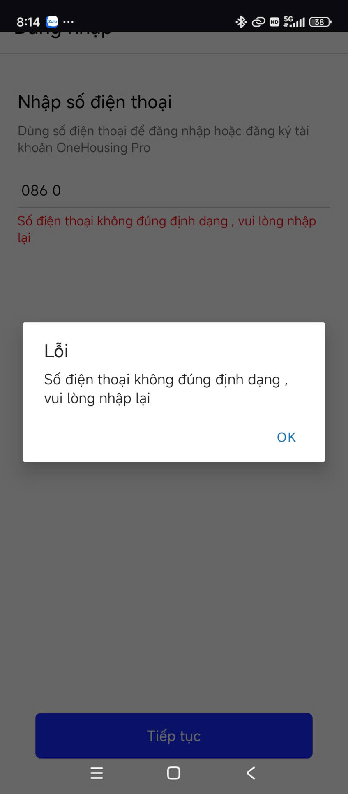
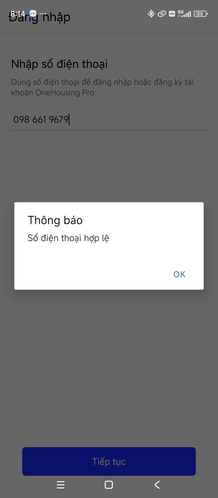

## Thông tin sinh viên
- Họ và tên: Trần Tiến Đạt
- Mã sinh viên: 23810310322

## Mô tả
Bài tập 6.1: Ôn tập state - useState. TextInput - Validation và Format
( Dạ thầy ơi bài Bài tập 03.1: Custom component trc đó em đẩy lên rồi mà ấn nộp mạng yếu không lên đc em không chú ý nên ko đc nộp nếu tính điểm thầy bỏ qua cho em v ạ )
.

## Hình ảnh kết quả chạy

